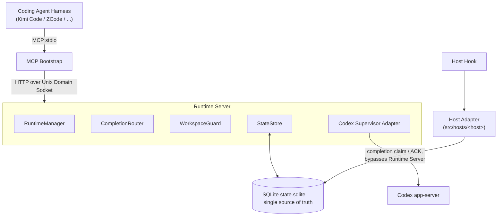

# Codex As Subagent

**Turn your local OpenAI Codex into a subagent runtime for any coding-agent harness.**

[中文 README](README.zh-CN.md)

Codex As Subagent (CAS) lets your coding agent spawn real Codex threads as background subagents: delegate a task, keep working in your main session, and get the result delivered back automatically when the subagent finishes. No extra API keys — it runs on the Codex you already logged into.

Currently adapted harnesses: **Kimi Code** and **ZCode**. The architecture is harness-agnostic — see [Roadmap](#roadmap).

## Quick start

```bash
git clone --recurse-submodules https://github.com/EdgarZhong/CodexAsSubagent.git
cd CodexAsSubagent
./setup.sh                                        # Node >= 24 check, vendor submodule, deps, doctor

# then install into your harness:
node src/cli/main.mjs install --host=kimi-code    # Kimi Code — then /reload or start a new session
node src/cli/main.mjs install --host=zcode        # ZCode
```

Requires Node.js ≥ 24 and a logged-in Codex on this machine — see [Requirements](#requirements). Installer options and the ZCode GUI path: [Install](#install).

## A typical session

```text
You:    Spawn a Codex subagent to refactor the auth module while I review the API tests.
Agent:  → codex_spawn → returns threadId in a second. Both of you keep working.

        ... minutes later, in the middle of another conversation turn ...

Agent:  <codex-completion> threadId=… status=completed
        Refactored auth module into 3 files, summary: … changed files: …

You:    The error handling looks off — steer it to use Result types instead.
Agent:  → codex_steer → the running subagent changes course immediately.
```

Delegation never blocks you, and completions find their own way back — even if they finish mid-turn, after a restart, or while you're in a different conversation.

## What you get

- **Parallel delegation, async by default, zero waiting.** Spawn one subagent or five with `codex_spawn`; each returns instantly and runs in the background while your main session stays responsive.
- **Results delivered to your session.** Finished work is injected back into the exact session that asked for it — hook-based, automatic, and never lost, even if CAS or the host restarts midway.
- **Stay in control mid-flight.** Follow up on a finished thread (`codex_send`), redirect a running one (`codex_steer`), or stop it (`codex_interrupt`) — interrupted work is still delivered with everything it produced.
- **Pull when you prefer.** `codex_wait` / `codex_wait_many` (up to 500s), `codex_status`, `codex_read_thread`, `codex_list_threads` for synchronous collection whenever you want it.
- **Across harnesses — held threads are protected.** A thread actively held by one harness answers every other harness with a clear `thread_held` (naming the holder) — never silent interference. When the holder harness exits, any harness can transparently take the thread over.
- **Within one harness — sessions take turns.** While one session has a subagent actively running, another session's CAS calls are vetoed until that turn ends, then ownership hands over automatically. A running turn answers `codex_send` with `thread_busy` and steer/interrupt with `session_conflict`; once idle, any of your sessions can continue the thread.
- **Many windows, no mix-ups.** Run several sessions and harnesses side by side; every result lands in the session that spawned it, never a neighbor's.
- **Your Codex, your machine.** Uses the Codex you're already logged into. Nothing leaves your machine; your Codex transcripts stay untouched in `~/.codex/`.
- **Zero maintenance.** The runtime starts itself on first use and exits when idle. All state is one local SQLite file.
- **You pick the model.** `codex_models` lists the Codex models and reasoning efforts available on your machine, and you can explicitly set model and effort for each subagent when spawning or messaging it. CAS's out-of-the-box default profile: `gpt-5.6-luna` + `xhigh`.

## Supported harnesses

| Harness | Status | Integration |
|---|---|---|
| Kimi Code (TUI & Web) | ✅ Supported | `plugins/kimi-code` — MCP server in user-level `mcp.json`, hooks on `PreToolUse` / `Stop` / `UserPromptSubmit` |
| ZCode | ✅ Supported | `plugins/zcode` — `.mcp.json` + hooks on `PreToolUse` / `PostToolUse` / `UserPromptSubmit` / `Stop` |

### Bring your own harness

A harness is adaptable when it provides:

1. **stdio MCP servers**, spawned with the session's workspace as CWD;
2. **Lifecycle hooks** (equivalents of `PreToolUse` / `Stop` / `UserPromptSubmit`) whose payload carries a session identity and CWD.

Integration then means a host adapter in `src/hosts/<host>.mjs` (native payload parsing) plus plugin resources in `plugins/<host>/`. The core runtime contains no per-harness branches.

## Roadmap

- **Now**: Kimi Code, ZCode
- **Next**: Claude Code (via its new mod/extension paradigm), Pi
- **Then**: DSH
- **Later**: Grok Build, Gemini CLI

## Requirements

- **Node.js ≥ 24**.
- A **logged-in OpenAI Codex** on this machine (standalone Codex CLI or the one embedded in ChatGPT.app — CAS finds it automatically; `CODEX_BIN` overrides).
- **macOS** is the tested platform. Linux is expected to work but not yet verified; Windows is not supported.

## Install

[Quick start](#quick-start) covers the standard flow (`git clone` → `./setup.sh` → `install --host=<host>`). Details:

```bash
# Kimi Code
node src/cli/main.mjs install --host=kimi-code
# then run /reload in Kimi, or start a new session

# ZCode
node src/cli/main.mjs install --host=zcode
# or use ZCode's GUI: Settings → Plugin Management → Discover
```

Both installers are idempotent, back up overwritten host state (`*.bak-cas`), and support `--dry-run`. ZCode also has a GUI-native path via the marketplace in this repo's root (`marketplace.json`); see [plugins/zcode/README.md](plugins/zcode/README.md) and [plugins/kimi-code/README.md](plugins/kimi-code/README.md) for details.

Sanity-check your setup anytime:

```bash
node src/cli/main.mjs doctor --json
```

## The ten tools

Once installed, your harness gains ten MCP tools (e.g. `mcp__codex-as-subagent__codex_spawn`):

| Tool | What it does |
|---|---|
| `codex_spawn` | Start a new subagent thread. Always async — returns a `threadId` immediately. |
| `codex_send` | Send a follow-up message to an idle thread. |
| `codex_steer` | Redirect a thread while it is running. |
| `codex_interrupt` | Stop a running thread; its partial result is still delivered. |
| `codex_wait` / `codex_wait_many` | Block until one or more threads finish (max 500s). |
| `codex_status` | Snapshot of a thread's current state. |
| `codex_read_thread` | Read a thread's history and latest output. |
| `codex_list_threads` | List threads visible to your session. |
| `codex_models` | List available models and reasoning efforts. |

The model never chooses where a subagent works: every thread runs in your current project directory, exactly as your session sees it.

## Configuration

- Data directory: `~/.codex-as-subagent/` (SQLite state, socket, logs).
- Optional `~/.codex-as-subagent/config.toml`: incremental overrides of **Codex** configuration keys, applied on top of your Codex config when the runtime starts (invalid file = runtime refuses to start, never silent). See [config.example.toml](config.example.toml).
- **Decoupled from your own Codex setup**: these overrides live in CAS's data directory and apply only to subagents spawned through CAS — your personal `~/.codex/config.toml` and your direct Codex usage stay exactly as they are. Give subagents a different default model or effort without touching your own setup.
- `CODEX_BIN`: pin a specific Codex binary instead of auto-discovery.

## How it works

CAS does not reimplement an agent — Codex itself does the reasoning, tool calls, and file edits. CAS adds what subagent use needs on top: supervision, isolation, and delivery guarantees.



- One Codex thread **is** one subagent; `threadId` is the only public identity.
- A thin MCP bootstrap per session forwards to a shared runtime server, which supervises live Codex threads. All durable state lives in a single local SQLite database.
- Host hooks deliver completions straight from that database into your session — they don't depend on the runtime being up, and a result is only marked delivered after your session has actually received it.

## Known limitations

- **Shared Codex thread lock**: if another Codex client (sharing `~/.codex`) is occupying a thread, CAS write operations on it fail with `thread_locked`; read-only operations are unaffected.
- **Kimi Code delivery may swallow one tool call**: when a completion is delivered through Kimi's `PreToolUse` hook, the tool call that triggered it is vetoed once (it has not actually run) so the result can be injected first; the model retries the tool afterwards if still needed.
- **`codex_wait_many` array branch**: some models serialize array arguments into JSON strings; on such models use the `"all"` form instead.
- **Upgrading from V1**: V2 rebuilds its database from scratch; old runtime state (including delivered history) is not migrated.

## Product usage constraints

These are by design, not bugs:

- **One active CAS session per workspace at a time — for session-blind hosts only.** On hosts whose MCP tool calls cannot carry a session identity (both Kimi Code and ZCode today; session identity is only available through the hook channel), a single session per workspace may actively drive CAS; other sessions are vetoed until it goes idle, then ownership hands over automatically. For future **strong hosts** that pass session identity natively through MCP, this constraint will be lifted and multiple sessions will use CAS concurrently.
- **One shared runtime server per machine**, started lazily and stopped when idle.
- **The model never chooses the execution boundary**: subagents always run in your current project directory, and the MCP surface deliberately exposes no cwd, sandbox, or approval parameters.

## Documentation

The authoritative design specs and project documentation are currently written in Chinese.

| Document | Contents |
|---|---|
| [AGENTS.md](AGENTS.md) | Project-wide rules, workflows, boundaries, acceptance requirements |
| [CLAUDE.md](CLAUDE.md) | Current stage status, task board, decisions |
| [docs/CodexAsSubagent V2 Session 隔离与 Mailbox 架构设计.md](docs/CodexAsSubagent%20V2%20Session%20隔离与%20Mailbox%20架构设计.md) | V2 authoritative spec: session identity, mailbox, fail-closed/recovery matrix |
| [docs/CodexAsSubagent V2 串投修复与 Kimi Code 集成适配说明.md](docs/CodexAsSubagent%20V2%20串投修复与%20Kimi%20Code%20集成适配说明.md) | V2 authoritative spec: claim predicates, Kimi integration |
| [docs/CodexAsSubagent V2 Host 隔离、Thread Hold 与 CLI-Adapter 实施规格.md](docs/CodexAsSubagent%20V2%20Host%20隔离、Thread%20Hold%20与%20CLI-Adapter%20实施规格.md) | V2 authoritative spec: thread hold/presence, CLI protocol, acceptance scenarios |
| [docs/Codex As Subagent — 详细设计与编码规格.md](docs/Codex%20As%20Subagent%20—%20详细设计与编码规格.md) | V1 baseline spec (superseded sections removed) |
| [docs/autonomous-runs/](docs/autonomous-runs/) | User-level acceptance records with real-session evidence |
| [docs/research/](docs/research/) | External research (Codex runtime discovery, ZCode hook protocol) |
| [plugins/kimi-code/README.md](plugins/kimi-code/README.md) | Kimi Code plugin & installer details |
| [plugins/zcode/README.md](plugins/zcode/README.md) | ZCode plugin & installer details |

## Development

```bash
npm test          # unit + integration tests (node --test)
npm run lint      # syntax check over src/**/*.mjs
npm run smoke     # CLI smoke test
```

Contributions welcome — please read [AGENTS.md](AGENTS.md) first; the runtime's isolation and delivery invariants are load-bearing.

## License

MIT. `vendor/codex-supervisor-mcp` retains its upstream MIT license and copyright.
