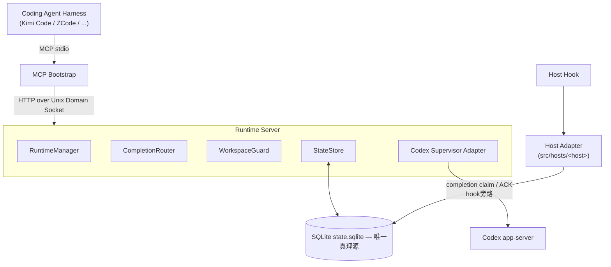

# Codex As Subagent

**把你本机的 OpenAI Codex 变成任意 Coding Agent Harness 的 Subagent Runtime。**

[English README](README.md)

Codex As Subagent（CAS）让你的编程 Agent 把真实的 Codex 线程当作后台子代理使用：派发一个任务，主会话继续干活，子代理完成后结果自动回流注入。不需要额外的 API Key——它运行在你已经登录的 Codex 之上。

当前已适配的 Harness：**Kimi Code** 与 **ZCode**。架构本身与 Harness 无关，见 [Roadmap](#roadmap)。

## 快速上手

```bash
git clone --recurse-submodules https://github.com/EdgarZhong/CodexAsSubagent.git
cd CodexAsSubagent
./setup.sh                                        # 检查 Node ≥ 24、vendor 子模块、依赖、doctor 自检

# 然后安装到你的 Harness：
node src/cli/main.mjs install --host=kimi-code    # Kimi Code——随后 /reload 或新开会话
node src/cli/main.mjs install --host=zcode        # ZCode
```

要求本机 Node.js ≥ 24 且已登录 Codex，见[运行环境](#运行环境)。安装器选项与 ZCode GUI 路线见[安装](#安装)。

## 一次典型的使用

```text
你：     起一个 Codex 子代理去重构 auth 模块，我继续看 API 测试。
Agent：  → codex_spawn → 一秒内返回 threadId。两边同时开工。

         ……几分钟后，另一个对话回合进行中……

Agent：  <codex-completion> threadId=… status=completed
         已把 auth 模块拆成 3 个文件，摘要：… 修改文件：…

你：     错误处理不对——让它改用 Result 类型。
Agent：  → codex_steer → 运行中的子代理立刻转向。
```

派发永远不阻塞你，完成结果会自己找到回来的路——哪怕它在回合中途完成、在你重启之后落地、或你已经切到了别的对话。

## 你能得到什么

- **并行派发，默认异步，零等待**：`codex_spawn` 起一个或一批子代理，每次调用立即返回，主会话保持响应。
- **结果送上门**：完成的工作自动注入发起它的那个会话——基于hooks，自动、不丢失，即使中途CAS或host重启。
- **全程可干预**：对已完成线程追加消息（`codex_send`）、给运行中的转向（`codex_steer`）、或直接中断（`codex_interrupt`）——被中断的工作连同已有产出照常送达。
- **想主动收也可以**：`codex_wait` / `codex_wait_many`（最多 500 秒）、`codex_status`、`codex_read_thread`、`codex_list_threads`，随时同步拿结果。
- **跨 Harness：被持有的线程抢不走**。某个 Harness 活跃持有的线程，其他 Harness 的任何操作都会得到明确的 `thread_held`（并告知持有者是谁），绝不静默互相干扰；持有者 Harness 退出后，任何 Harness 都能透明接手该线程。
- **Harness 内部：会话轮流用**。同一 Harness 里，某会话有子代理正在运行时，其他会话的 CAS 调用会被 veto 暂缓，等它的回合结束后归属自动交接。运行中的线程对其他会话：`codex_send` 报 `thread_busy`，转向/中断报 `session_conflict`；线程空闲后，你的任何会话都可直接续用。
- **开多少窗口都不串**：多个会话、多个 Harness 同时跑，每条结果都精确回到派发它的会话，绝不送到隔壁。
- **你的 Codex，你的机器**：跑在你已登录的 Codex 上，数据不出本机，Codex 的 transcript 留在 `~/.codex/` 原样不动。
- **零维护**：Runtime 首次使用时自动启动、空闲自动退出，全部状态就一个本地 SQLite 文件。
- **模型听你指挥**：`codex_models` 列出本机可用的 Codex 模型与 reasoning effort 清单，派发或追加消息时可以为每个子代理显式指定模型和 effort。CAS 开箱默认 profile：`gpt-5.6-luna` + `xhigh`。

## 已适配 Harness

| Harness | 状态 | 集成方式 |
|---|---|---|
| Kimi Code（TUI 与 Web） | ✅ 已支持 | `plugins/kimi-code`：MCP 注册到用户级 `mcp.json`，Hook 挂 `PreToolUse` / `Stop` / `UserPromptSubmit` |
| ZCode | ✅ 已支持 | `plugins/zcode`：`.mcp.json` + `PreToolUse` / `PostToolUse` / `UserPromptSubmit` / `Stop` 四个 Hook 事件 |

### 接入你自己的 Harness

一个 Harness 可适配的条件：

1. 支持 **stdio MCP server**，且以会话 workspace 作为 CWD 拉起；
2. 提供**生命周期 Hook**（`PreToolUse` / `Stop` / `UserPromptSubmit` 的等价物），且 payload 携带 session 身份与 CWD。

集成工作 = 在 `src/hosts/<host>.mjs` 写一个 Host Adapter（解析 native payload）+ 在 `plugins/<host>/` 提供插件资源。核心 Runtime 不含任何 per-Harness 分支。

## Roadmap

- **当前**：Kimi Code、ZCode
- **下一级**：Claude Code（基于其新 Mod 扩展范式）、Pi
- **再下一级**：DSH
- **更远**：Grok Build、Gemini CLI

## 运行环境

- **Node.js ≥ 24**。
- 本机**已登录的 OpenAI Codex**（独立 Codex CLI 或 ChatGPT.app 内嵌均可，CAS 自动发现；`CODEX_BIN` 可覆盖）。
- **macOS** 是已验收平台。Linux 预期可用但尚未验证；Windows 不支持。

## 安装

[快速上手](#快速上手)已覆盖标准流程（`git clone` → `./setup.sh` → `install --host=<host>`）。细节：

```bash
# Kimi Code
node src/cli/main.mjs install --host=kimi-code
# 然后在 Kimi 中执行 /reload，或新开会话

# ZCode
node src/cli/main.mjs install --host=zcode
# 或走 ZCode GUI：Settings → Plugin Management → Discover
```

两个安装器都幂等，覆盖宿主状态前各保留 `*.bak-cas` 备份，支持 `--dry-run`。ZCode 还有基于本仓库根目录 `marketplace.json` 的 GUI 原生路线；详见 [plugins/zcode/README.md](plugins/zcode/README.md) 与 [plugins/kimi-code/README.md](plugins/kimi-code/README.md)。

随时自检环境：

```bash
node src/cli/main.mjs doctor --json
```

## 十个工具

安装后，你的 Harness 多出十个 MCP 工具（如 `mcp__codex-as-subagent__codex_spawn`）：

| 工具 | 作用 |
|---|---|
| `codex_spawn` | 启动新子代理线程。永远异步——立即返回 `threadId`。 |
| `codex_send` | 向空闲线程追加消息。 |
| `codex_steer` | 在线程运行中给它转向。 |
| `codex_interrupt` | 中断运行中的线程；已有产出照常送达。 |
| `codex_wait` / `codex_wait_many` | 阻塞等一个或多个线程完成（最多 500 秒）。 |
| `codex_status` | 查看线程当前状态快照。 |
| `codex_read_thread` | 读线程历史与最新输出。 |
| `codex_list_threads` | 列出当前会话可见的线程。 |
| `codex_models` | 列出可用模型与 reasoning effort。 |

模型无权选择子代理在哪里工作：每个线程都运行在你当前的项目目录里，与你的会话所见一致。

## 配置

- 数据目录：`~/.codex-as-subagent/`（SQLite 状态、socket、日志）。
- 可选 `~/.codex-as-subagent/config.toml`：对 **Codex** 配置键做增量覆写，在 Runtime 启动时叠加在你的 Codex 配置之上（文件非法则拒绝启动，绝不静默）。参考 [config.example.toml](config.example.toml)。
- **与你自己的 Codex 配置解耦**：覆写放在 CAS 的数据目录里，只作用于经 CAS 派发的子代理——你的个人 `~/.codex/config.toml` 和你直接使用 Codex 的行为完全不受影响。想让子代理用不同的默认模型或 effort，不必动自己的配置。
- `CODEX_BIN`：指定 Codex 二进制，替代自动发现。

## 工作原理

CAS 不重新实现 Agent——推理、工具调用、文件修改都由 Codex 自己完成。CAS 在其上补齐子代理化所需的部分：supervision、隔离与投递保证。



- 一个 Codex 线程**就是**一个子代理，`threadId` 是唯一对外身份。
- 每个会话一个薄 MCP Bootstrap，转发到共享 Runtime Server，由它监督活跃的 Codex 线程；全部持久状态在一个本地 SQLite 库里。
- 宿主 Hook 直接从该库把完成结果投递进你的会话——不依赖 Runtime 在线，且只有你的会话真正收到后结果才被标记为已投递。

## 已知限制

- **Codex 共享线程锁**：若另一 Codex 客户端（共享 `~/.codex`）正占用某线程，CAS 对它的写操作失败为 `thread_locked`；只读操作不受影响。
- **Kimi Code 回流可能吞掉一次工具调用**：completion 经 Kimi 的 `PreToolUse` Hook 注入时，触发该 Hook 的那个工具调用会被 veto 一次（工具实际未执行），以便先把结果注入；如仍有需要，模型随后会重试该工具。
- **`codex_wait_many` 数组分支**：部分模型会把数组参数序列化为 JSON 字符串，在这类模型下请改用 `"all"` 形态。
- **从 V1 升级**：V2 会重建数据库，旧 runtime 状态（含已投递历史）不迁移。

## 产品使用约束

以下是有意的设计，不是缺陷：

- **同一 workspace 同一时刻只有一个会话能活跃使用 CAS——仅针对弱 Host**。这条约束针对的是「MCP 工具调用无法携带 session 身份」的弱 Host（当前的 Kimi Code 与 ZCode 均属此类，session 身份只能经 Hook 通道获得）：这类 Host 下，同一 workspace 同时只有一个会话能驱动 CAS，其他会话被 veto 暂缓，等它空闲后归属自动交接。未来支持**能在 MCP 层原生传递 session 身份的强 Host** 后，该 Host 将取消这一约束，多会话可并发使用 CAS。
- **整机一个共享 Runtime Server**，按需懒启动、空闲自动退出。
- **模型无权选择执行边界**：子代理永远运行在你当前的项目目录里，MCP 工具面有意不提供 cwd、sandbox、approval 参数。

## 文档索引

| 文档 | 内容 |
|---|---|
| [AGENTS.md](AGENTS.md) | 项目通用规则、流程、边界与验收要求 |
| [CLAUDE.md](CLAUDE.md) | 当前阶段进度、任务看板与决策 |
| [docs/CodexAsSubagent V2 Session 隔离与 Mailbox 架构设计.md](docs/CodexAsSubagent%20V2%20Session%20隔离与%20Mailbox%20架构设计.md) | V2 权威规格：Session Identity、Mailbox、Fail-Closed/Recovery Matrix |
| [docs/CodexAsSubagent V2 串投修复与 Kimi Code 集成适配说明.md](docs/CodexAsSubagent%20V2%20串投修复与%20Kimi%20Code%20集成适配说明.md) | V2 权威规格：claim 谓词、Kimi 集成适配 |
| [docs/CodexAsSubagent V2 Host 隔离、Thread Hold 与 CLI-Adapter 实施规格.md](docs/CodexAsSubagent%20V2%20Host%20隔离、Thread%20Hold%20与%20CLI-Adapter%20实施规格.md) | V2 权威规格：Thread Hold/Presence、CLI 协议、验收场景 |
| [docs/Codex As Subagent — 详细设计与编码规格.md](docs/Codex%20As%20Subagent%20—%20详细设计与编码规格.md) | V1 基线规格（被取代小节已移除） |
| [docs/autonomous-runs/](docs/autonomous-runs/) | 真实会话用户级验收记录 |
| [docs/research/](docs/research/) | 外部调研（Codex runtime 发现、ZCode Hook 协议取证） |
| [plugins/kimi-code/README.md](plugins/kimi-code/README.md) | Kimi Code 插件与安装器细节 |
| [plugins/zcode/README.md](plugins/zcode/README.md) | ZCode 插件与安装器细节 |

## 开发

```bash
npm test          # 单元 + 集成测试（node --test）
npm run lint      # src/**/*.mjs 语法检查
npm run smoke     # CLI 冒烟
```

欢迎贡献——动手前请先读 [AGENTS.md](AGENTS.md)；Runtime 的隔离与投递不变式是承重设计。

## 许可证

MIT。`vendor/codex-supervisor-mcp` 保留其上游 MIT License 与版权声明。

